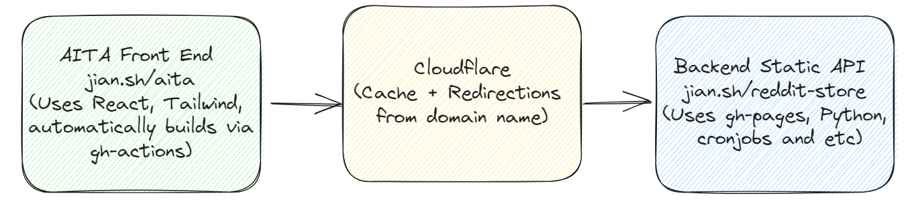

# AITA Visualisation Front End

This repository is the front end for the AITA data set. It is currently configured to remotely deployed upon pushes into the repository.

## System Architecture Brief

## URLs

- Frontend - http://github.com/JianLoong/aita

- Backend - http://github.com/JianLoong/reddit-store 

## Technologies used 
- React using TypeScript
- DaisyUI
- Vite

## Improvements
- **Security**: Implemented HTML sanitization using `DOMPurify` to prevent XSS vulnerabilities.
- **Code Quality**: Fixed linting errors related to `prefer-const` and React Hooks rules.
- **Type Safety**: Corrected type definitions for improved type safety.